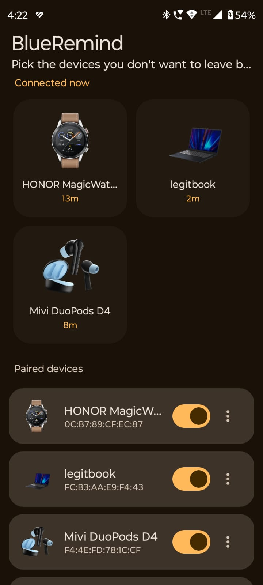
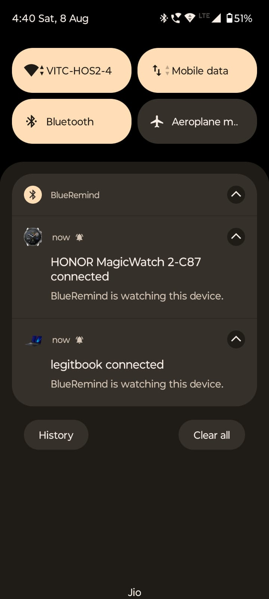
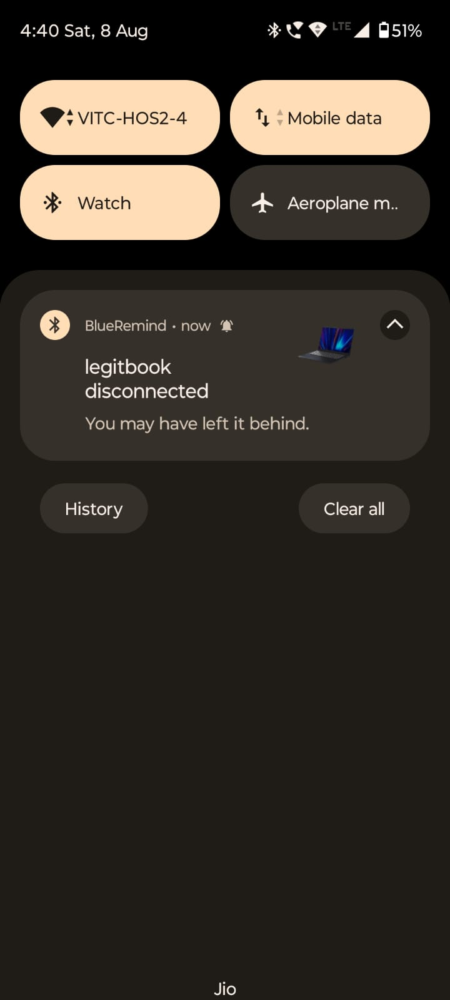

<h1 align="center">BlueRemind</h1>

<p align="center">
  Your phone buzzes the moment a watched Bluetooth device drops off.<br>
  Notice the watch, the earbuds or the laptop before you have walked away from it.
</p>

<p align="center">
  <a href="#"></a>
  <a href="https://legitcoconut.github.io/blueremind/"></a>
</p>

<table align="center">
  <tr>
    <td align="center" width="33%"></td>
    <td align="center" width="33%"></td>
    <td align="center" width="33%"></td>
  </tr>
  <tr>
    <td align="center"><sub>Pick what to watch</sub></td>
    <td align="center"><sub>Quiet notice on connect</sub></td>
    <td align="center"><sub>Buzzing alert on disconnect</sub></td>
  </tr>
</table>

## What it does

Pick which of your paired devices to watch. A connect posts a quiet notification. A disconnect,
whether you walked out of range or the battery died, fires a high priority alert with a vibration
pattern you will feel through a pocket.

Watched devices that are connected sit in a grid at the top, each with a live uptime. Give any
device its own name and photo and both follow it into the notifications.

No account, no background service, no location access. It wakes on the system's Bluetooth
broadcasts and does nothing in between.

## Adding a device to the watch list

1. **Pair the device first.** BlueRemind lists what Android has already paired. It never scans.
2. **Grant both prompts on first launch.** Nearby devices reads your paired list and detects
   connections. Notifications lets the alert reach you.
3. **Flip the switch on its row** under Paired devices. It jumps to the top. That is the whole setup.
4. **Optional: tap `⋮` to rename it or change its picture.** Pictures are copied into the app's own
   storage, so clearing your gallery later changes nothing. Reset restores the Bluetooth name and
   the default icon.
5. **Done.** Connected devices appear under Connected now with their uptime. Walk away and the
   alert fires.

> [!NOTE]
> Xiaomi, Samsung and OnePlus ROMs kill background receivers aggressively. If alerts stop arriving,
> exempt BlueRemind from battery optimisation in Android's app settings.

## Build it yourself

Needs JDK 17 and the Android SDK with platform 34 and build-tools 34.0.0. Android Studio is not
required. Point `local.properties` at your SDK with `sdk.dir=/path/to/android-sdk`, then:

```bash
gradle assembleDebug     # app/build/outputs/apk/debug/app-debug.apk
gradle assembleRelease   # app/build/outputs/apk/release/app-release.apk
```

Release builds are minified with R8 and signed from a `keystore.properties` at the repo root, which
is gitignored. Without that file the build still succeeds and produces an unsigned APK.

The app contains no native code, so a single APK runs on every architecture.

## Built with

[](https://openjdk.org/)
[](https://m3.material.io/)
[](https://developer.android.com/)

No third-party services.

---

<p align="center"><sub>Built by <a href="https://github.com/legitcoconut/">LegitCoconut</a></sub></p>
